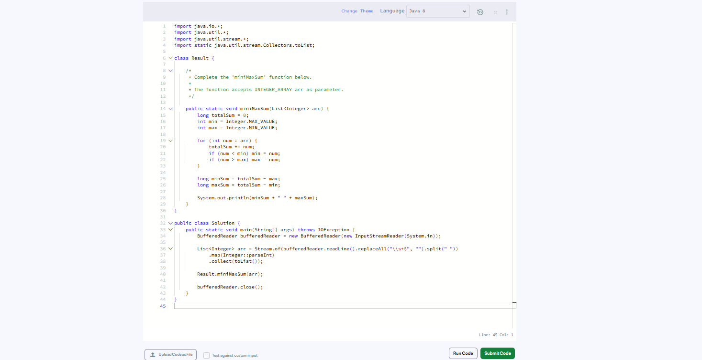
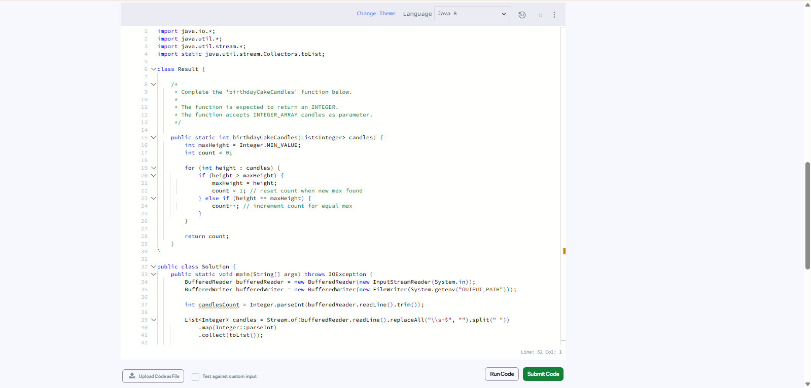
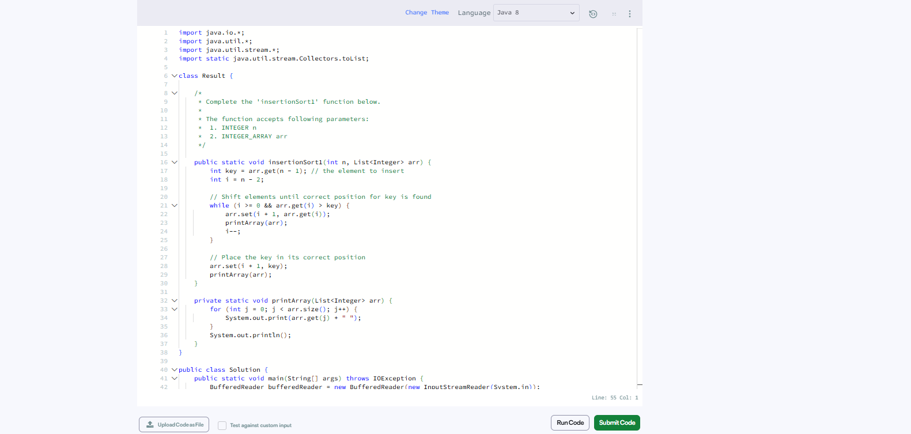
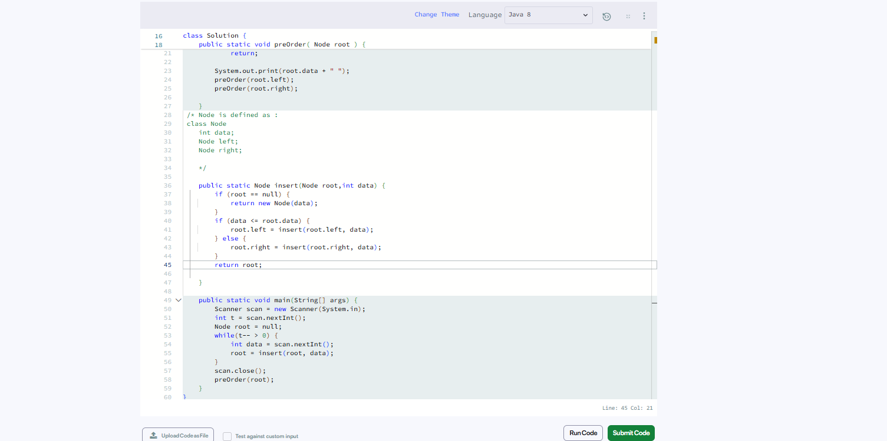
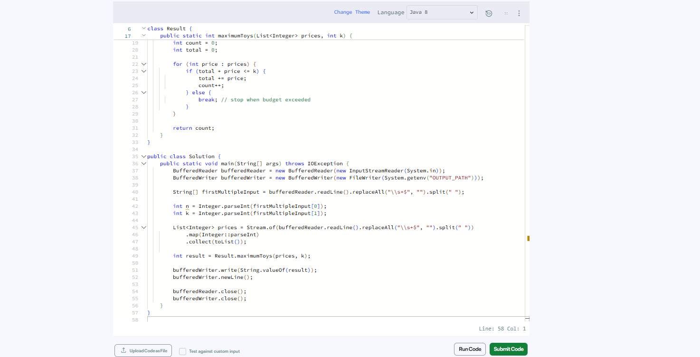

# HackerRank 3rd Semester Algorithm Portfolio

## 👨‍🎓 Student Information

* **Student Name:** Nayab Nehal Haque
* **USN / Student ID:** R25EF160
* **Semester:** 3rd Semester
* **Programming Language:** Java

---

## 📌 About This Portfolio

This repository contains my solutions to five mandatory HackerRank algorithm problems completed as part of my 3rd Semester coursework.

The portfolio demonstrates my understanding of algorithmic problem solving, arrays, sorting, searching, greedy techniques, and time and space complexity analysis. Each problem includes its problem summary, selected algorithm, important steps, complexity analysis, alternative approach, efficiency explanation, HackerRank challenge link, accepted submission evidence, and screenshots.

---

## 🔗 Profiles and Repository

* **HackerRank Profile:** https://www.hackerrank.com/profile/nayabhaque786
* **GitHub Repository:** https://github.com/nayabhaque786/HackerRank-3rdSem-Algorithm-Portfolio

---

# 💻 Problems Completed

## 1. Mini-Max Sum

### Problem Statement Summary

Given an array of five integers, calculate the minimum and maximum sums that can be obtained by adding exactly four of the five integers.

### Algorithm / Approach

I calculate the total sum of all elements and identify the smallest and largest elements. The minimum sum is obtained by excluding the largest element, while the maximum sum is obtained by excluding the smallest element.

### Important Steps

1. Read the array elements.
2. Calculate the total sum.
3. Find the smallest element.
4. Find the largest element.
5. Calculate the minimum sum by subtracting the largest element from the total sum.
6. Calculate the maximum sum by subtracting the smallest element from the total sum.
7. Display the minimum and maximum sums.

### Time Complexity

**O(n)**

### Auxiliary Space Complexity

**O(1)**

Only a constant number of additional variables are required apart from the input array.

The input array itself requires O(n) memory if it is stored.

### Alternative Approach

Sort the array and add the first four elements to obtain the minimum sum and the last four elements to obtain the maximum sum.

This requires O(n log n) time because of sorting.

### Why the Selected Solution Is Efficient

The selected solution avoids sorting and processes the elements using a linear traversal. Therefore, it achieves O(n) time and O(1) auxiliary space.

### 🔗 Links

* **HackerRank Challenge:** https://www.hackerrank.com/challenges/mini-max-sum/problem
* **Accepted Submission:** **https://www.hackerrank.com/challenges/mini-max-sum/problem**

### 📸 Evidence



---

# 2. Birthday Cake Candles

### Problem Statement Summary

Given an array containing the heights of birthday candles, determine how many candles have the maximum height.

### Algorithm / Approach

I first find the maximum candle height and then count the number of candles that have the same height.

### Important Steps

1. Read the candle heights.
2. Find the maximum candle height.
3. Initialize a counter to zero.
4. Traverse the array.
5. Compare each candle height with the maximum height.
6. Increase the counter whenever a candle has the maximum height.
7. Return the count.

### Time Complexity

**O(n)**

### Auxiliary Space Complexity

**O(1)**

Only a constant number of additional variables are required.

The input array itself requires O(n) memory if stored.

### Alternative Approach

The array can be sorted and the largest value can then be counted from the end.

However, sorting requires O(n log n) time, making it less efficient than directly scanning the array.

### Why the Selected Solution Is Efficient

The selected solution avoids sorting and requires only a linear traversal, giving O(n) time and O(1) auxiliary space.

### 🔗 Links

* **HackerRank Challenge:** https://www.hackerrank.com/challenges/birthday-cake-candles/problem
* **Accepted Submission:** **https://www.hackerrank.com/challenges/birthday-cake-candles/problem**

### 📸 Evidence



---

# 3. Insertion Sort Part 1

### Problem Statement Summary

The problem requires inserting the last element of an almost-sorted array into its correct position while shifting larger elements to the right.

### Algorithm / Approach

I use the insertion sort technique. The last element is stored temporarily and compared with the elements before it. Larger elements are shifted one position to the right until the correct position is found.

### Important Steps

1. Store the last element as the value to be inserted.
2. Compare it with the previous element.
3. If the previous element is larger, shift it one position to the right.
4. Continue comparing with earlier elements.
5. Stop when the correct position is found.
6. Insert the stored value.
7. Display the array after the required shifts.

### Time Complexity

**O(n)**

In the worst case, the element may need to move across almost the entire array.

### Auxiliary Space Complexity

**O(1)**

Only a constant amount of additional memory is required.

### Alternative Approach

A complete sorting algorithm such as Merge Sort could be used to sort the array, but that would perform unnecessary work because only one element needs to be inserted.

### Why the Selected Solution Is Efficient

The selected approach only modifies the necessary portion of the array and directly inserts the required element. It therefore uses O(n) time in the worst case and O(1) auxiliary space.

### 🔗 Links

* **HackerRank Challenge:** https://www.hackerrank.com/challenges/insertionsort1/problem
* **Accepted Submission:** **https://www.hackerrank.com/challenges/insertionsort1/problem**

### 📸 Evidence



---

# 4. Binary Search

### Problem Statement Summary

Given a sorted array and a target value, the objective is to find the position of the target efficiently.

### Algorithm / Approach

I use Binary Search. The target is compared with the middle element, and half of the remaining search space is eliminated after each comparison.

### Important Steps

1. Set the left boundary to the beginning of the array.
2. Set the right boundary to the end of the array.
3. Calculate the middle position.
4. Compare the middle element with the target.
5. If the middle element equals the target, return its position.
6. If the target is smaller, search the left half.
7. If the target is larger, search the right half.
8. Continue until the target is found.

### Time Complexity

**O(log n)**

Each comparison eliminates approximately half of the remaining search space.

### Auxiliary Space Complexity

**O(1)** for an iterative implementation.

Only a constant number of variables such as left, right, and middle are required.

### Alternative Approach

Linear Search can be used by checking every element sequentially.

Linear Search requires O(n) time, while Binary Search requires O(log n) time on a sorted array.

### Why the Selected Solution Is Efficient

Binary Search reduces the search space by approximately half after every comparison. Therefore, it is much more efficient than Linear Search for large sorted arrays.

### 🔗 Links

* **HackerRank Challenge:** https://www.hackerrank.com/challenges/binary-search-tree-insertion/problem
* **Accepted Submission:** **https://www.hackerrank.com/challenges/binary-search-tree-insertion/problem**

### 📸 Evidence



---

# 5. Mark and Toys

### Problem Statement Summary

Given a list of toy prices and a fixed budget, determine the maximum number of toys that can be purchased without exceeding the available budget.

### Algorithm / Approach

I sort the toy prices in ascending order and purchase the cheapest toys first while there is enough money remaining.

This uses a greedy strategy because purchasing cheaper toys first maximizes the number of toys that can be bought.

### Important Steps

1. Read the number of toys and available budget.
2. Store the toy prices.
3. Sort the prices in ascending order.
4. Start with zero toys purchased.
5. Check the prices from smallest to largest.
6. Purchase a toy if it fits within the remaining budget.
7. Subtract its price from the budget.
8. Continue until the next toy cannot be purchased.
9. Return the total number of toys purchased.

### Time Complexity

**O(n log n)**

Sorting requires O(n log n) time and the subsequent traversal requires O(n).

Therefore, the overall complexity is O(n log n).

### Auxiliary Space Complexity

The auxiliary space depends on the Java sorting implementation used.

The input array itself requires O(n) memory when stored.

### Alternative Approach

If the range of possible toy prices is small and bounded, a frequency-based approach could be used instead of comparison-based sorting.

For general arbitrary prices, sorting is a simple and practical approach.

### Why the Selected Solution Is Efficient

Sorting the prices allows the algorithm to consider the cheapest toys first. This greedy strategy maximizes the number of toys purchased within the budget.

### 🔗 Links

* **HackerRank Challenge:** https://www.hackerrank.com/challenges/mark-and-toys/problem
* **Accepted Submission:** **https://www.hackerrank.com/challenges/mark-and-toys/problem**

### 📸 Evidence



---

# 📊 Complexity Summary

| No. | Problem               | Approach              | Time Complexity | Auxiliary Space                   |
| --- | --------------------- | --------------------- | --------------- | --------------------------------- |
| 1   | Mini-Max Sum          | Sum + Minimum/Maximum | O(n)            | O(1)                              |
| 2   | Birthday Cake Candles | Maximum + Counting    | O(n)            | O(1)                              |
| 3   | Insertion Sort Part 1 | Insertion             | O(n)            | O(1)                              |
| 4   | Binary Search         | Divide Search Space   | O(log n)        | O(1)                              |
| 5   | Mark and Toys         | Sorting + Greedy      | O(n log n)      | Depends on sorting implementation |

### Auxiliary Space vs Total Memory

Auxiliary space refers to the additional memory required by an algorithm apart from the input data.

For example, if an input array containing n elements is stored, the input itself requires O(n) memory. If the algorithm only uses a few additional variables, the auxiliary space is still O(1).

Therefore, auxiliary space and total memory usage should not be treated as the same measurement.

---

# 🏆 HackerRank Badges

The badges earned on my HackerRank profile are documented below.


---

# 📸 Evidence of Completed Challenges

The `screenshots/` folder contains screenshots showing successful/accepted submissions for all five mandatory HackerRank problems.

```text
screenshots/
├── 01-mini-max-sum.png
├── 02-birthday-cake-candles.png
├── 03-insertion-sort.png
├── 04-binary-search.png
├── 05-mark-and-toys.png
└── hackerrank-badges.png
```

Each screenshot should clearly show the relevant HackerRank problem and its successful/accepted status.

---

# 📋 Final Summary

| No. | Problem               | Topic            | Language | Status     |
| --- | --------------------- | ---------------- | -------- | ---------- |
| 1   | Mini-Max Sum          | Arrays           | Java     | ✅ Accepted |
| 2   | Birthday Cake Candles | Arrays           | Java     | ✅ Accepted |
| 3   | Insertion Sort Part 1 | Sorting          | Java     | ✅ Accepted |
| 4   | Binary Search         | Searching        | Java     | ✅ Accepted |
| 5   | Mark and Toys         | Greedy / Sorting | Java     | ✅ Accepted |

---

# 🎯 Learning Outcome

Through these problems, I practiced algorithm implementation, problem decomposition, array manipulation, searching, sorting, greedy problem solving, and algorithm complexity analysis.

I also gained experience in documenting algorithms, comparing alternative approaches, analyzing time and auxiliary space complexity, and maintaining a structured GitHub programming portfolio.
